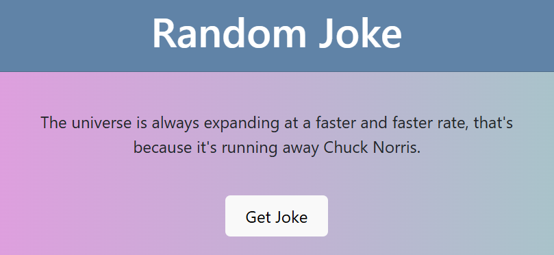

# 🤣 Random Joke Generator

Welcome to the **Random Joke Generator**! This web application fetches and displays a random joke with a single click, brightening your day with humor. 😄

  


---

## 🚀 Live Demo

Experience the fun here:  
👉 **[Live Demo](https://gulzaralice1.github.io/Random_Joke/)**

---

## 🔥 Features

- **One-Click Jokes**: Click the "Get Joke" button to fetch a new joke instantly.  
- **User-Friendly Interface**: Clean and intuitive design for a seamless experience.  
- **Responsive Design**: Optimized for all device sizes.

---

## 🛠️ Technologies Used

- **HTML5**: Structuring the content.  
- **CSS3**: Styling and layout.  
- **JavaScript**: Fetching jokes from an API and handling interactions.

---

## 📂 Project Structure
Random_Joke/ ├── index.html # Main HTML file ├── style.css # Styling file └── script.js # JavaScript file


---

## 🚀 Getting Started

### Prerequisites

Ensure you have the following:

- A modern web browser (Chrome, Firefox, Edge, etc.).

### Installation

1. **Clone the repository:**
   ```bash
   git clone https://github.com/Gulzaralice1/Random_Joke.git
    cd Random_Joke

